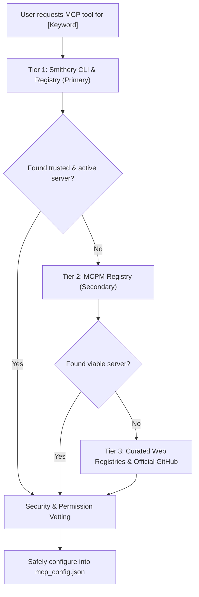

# Find MCP — Model Context Protocol Server Discovery & Setup

This skill guides the discovery, security vetting, and configuration of Model Context Protocol (MCP) servers across AI coding assistants using a strict priority-based hierarchy.

---

## When to Use This Skill

Activate this skill when the user:
- Asks "is there an MCP server for X?", "find an MCP for X", or "search MCP for X".
- Needs direct tool connectivity to external platforms (e.g., PostgreSQL, Docker, Figma, Slack, GitHub, Linear, AWS, S3, Telegram).
- Requests automated installation or configuration of an MCP server into `mcp_config.json`.
- Wants to compare available MCP solutions for a specific service or database.

---

## 3-Tier Priority Discovery Engine

Always execute search in strict order of priority. Only proceed to the next tier if the current tier yields no viable or maintained results.



---

### Tier 1: Smithery CLI (Primary — Largest Catalog & 1-Click Support)

[Smithery.ai](https://smithery.ai) is the primary ecosystem registry with over 2,000+ indexed servers and standardized manifest configurations.

#### Step 1.1: Run Search via CLI
Execute non-interactively in shell:
```bash
npx -y @smithery/cli mcp search "<keyword>"
```
*Example:* `npx -y @smithery/cli mcp search "postgres"` or `npx -y @smithery/cli mcp search "docker"`

#### Step 1.2: Parse & Present Options
Extract:
- Package name / ID
- Verified status / Author reputation
- Command & arguments schema required

If a high-quality, verified server is found, proceed directly to the **Security Vetting** phase.

---

### Tier 2: MCPM (Secondary — Dedicated Package Manager)

If Smithery has no suitable match, search via **MCPM** (`mcpm.sh`):

#### Step 2.1: Run Search via CLI
```bash
npx -y mcpm search "<keyword>"
```

#### Step 2.2: Evaluate Match
Review server descriptions and maintainer backing. If a solid match is found, extract its launch parameters.

---

### Tier 3: Curated Registries & Official Sources (Deep Fallback)

If neither CLI registry yields satisfactory results, query curated web registries and official repositories:

1. **Official MCP Servers Repository**:
   - `https://github.com/modelcontextprotocol/servers`
   - Contains reference implementations maintained by Anthropic/Google/ModelContextProtocol (e.g., `git`, `filesystem`, `postgres`, `sqlite`, `fetch`).
2. **Curated Indexes**:
   - **MCP.so**: `https://mcp.so/` (Categorized catalog)
   - **Glama MCP Directory**: `https://glama.ai/mcp/servers`
3. **Targeted Web Query**:
   - Run search: `"mcp-server-<keyword>" site:github.com` or `npm search "mcp-server-<keyword>"`

---

## Security & Vetting Gate (MANDATORY)

Before presenting or installing any MCP server, verify the following safety constraints:

1. **Execution Model**:
   - Prefer `npx -y <package>` or native binary executables over unverified shell scripts.
   - For remote endpoints, verify HTTPS endpoints (`https://.../mcp`).
2. **Environment & Secrets Sanitization**:
   - **NEVER** write real API keys or plain-text secrets directly into `mcp_config.json` without user approval.
   - Use environment variable placeholders (`${API_KEY}`) or instruct the user to provide the key.
3. **Resource Scope**:
   - If the server accesses the filesystem (e.g., `@modelcontextprotocol/server-filesystem`), ensure arguments are strictly scoped to the workspace directory, never root drives (`C:\` or `/`).

---

## Safe Configuration Protocol

Once approved by the user, configure the server into Antigravity / Claude config:

### Target File
- Global: `~/.gemini/config/mcp_config.json`
- Workspace (if scoped): `.gemini/mcp_config.json` or `.claude/mcp_config.json`

### Configuration Schema Example
```json
{
  "mcpServers": {
    "<server-id>": {
      "command": "npx",
      "args": [
        "-y",
        "<package-name>@latest",
        "<arg1>"
      ],
      "env": {
        "<ENV_KEY>": "YOUR_KEY_HERE"
      }
    }
  }
}
```

### Installation Steps
1. Read existing `~/.gemini/config/mcp_config.json`.
2. Merge the new entry under `mcpServers` (preserving all existing entries).
3. Validate JSON syntax with 0 trailing comma errors.
4. Notify the user to reload the client or restart the server session.

---

## Output Response Template

When responding to a user asking for an MCP server:

```markdown
### Kết quả tìm kiếm MCP cho [Tên công cụ]

1. **[Tên MCP Server đề xuất]** (Nguồn: [Smithery / MCPM / Official])
   - **Mô tả**: Tóm tắt chức năng chính
   - **Độ tin cậy**: Verified / [Số lượt tải / GitHub Stars]
   - **Lệnh thực thi**: `npx -y <package-name>`
   - **Biến môi trường cần thiết**: `API_KEY` (nếu có)

> **Bạn có muốn tôi tự động cấu hình MCP server này vào `mcp_config.json` không?**
```
