# 🛡️ BÁO CÁO TỔNG HỢP AN NINH & BẢNG ĐIỀU KHIỂN CỔNG DUYỆT (Security Master Report)

**Dự án:** Từ Điển Xơ Đăng - Việt (Web PWA & Electron Desktop)  
**Tài liệu:** `docs/security/06-report.md`  
**Phiên bản:** 1.1.0 (Bước 6 - Cổng Duyệt & Kế Hoạch Sửa Lỗi Chi Tiết)  
**Nhánh Git:** `sec/hardening` (Baseline tag: `pre-security`)  
**Chuẩn tham chiếu:** OWASP Top 10:2021, OWASP ASVS v4.0.3, CWE Top 25, NIST SSDF, SLSA v1.0, CVSS v3.1.  

---

## 1. Tóm Tắt Tình Hình An Ninh Dự Án (Executive Summary)

Sau 6 bước rà soát độc lập và có hệ thống (từ Bước 0 đến Bước 5):
* **Tổng số điểm vào (Entry Points):** 11 điểm vào trên toàn bộ Web PWA và Electron Desktop.
* **Tổng số ranh giới tin cậy (Trust Boundaries):** 5 ranh giới (TB1: Người dùng $\rightarrow$ DOM, TB2: Trình duyệt $\rightarrow$ Google APIs, TB3: Renderer $\rightarrow$ Main Process qua IPC, TB4: Dữ liệu mạng $\rightarrow$ Service Worker & Cache, TB5: Tệp đóng góp $\rightarrow$ Google Apps Script).
* **Kết quả quét bí mật & lịch sử:** 0 mật khẩu/private key bị lộ. Có 1 Google Cloud API Key (chỉ có quyền đọc Sheets công khai) đang hardcode trong cấu hình mặc định và lịch sử commit ban đầu.
* **Kết quả chuỗi cung ứng (SLSA):** 0 phụ thuộc CDN ngoài (100% tự lưu trữ), 0 lỗ hổng trên gói production (3 cảnh báo `npm audit` chỉ thuộc về môi trường test `devDependencies`).
* **Tổng số phát hiện cần xử lý:** **11 phát hiện** (0 P0, 3 P1, 6 P2, 2 P3).

---

## 2. Bảng Tổng Hợp Lỗ Hổng & Phát Hiện (Xếp Theo Thứ Tự Ưu Tiên P0 → P3)

| Mã | Phân loại | Tên lỗ hổng / Phát hiện | Vị trí tệp & dòng | Điểm CVSS v3.1 | Mức độ | Công sức sửa | Rủi ro vỡ tính năng | Thứ tự đề xuất |
|:---:|:---|:---|:---|:---:|:---:|:---:|:---:|:---:|
| **CODE-01** | XSS | DOM XSS qua Game 2 (Catcher) prompt | `src/renderer/features/games/game2-catcher.ts:120` | **7.1** (High) | **P1** | Thấp (15m) | Rất thấp (Giữ nguyên DOM class & style) | **#1** |
| **CODE-02** | XSS | DOM XSS qua Game 3 (Shooter) prompt | `src/renderer/features/games/game3-shooter.ts:113` | **7.1** (High) | **P1** | Thấp (15m) | Rất thấp (Giữ nguyên DOM class & style) | **#2** |
| **CODE-04** | Desktop | Missing `setWindowOpenHandler` & `will-navigate` | `src/main/index.ts:14-26` | **7.4** (High) | **P1** | Thấp (20m) | Rất thấp (Mở link ngoài bằng trình duyệt mặc định) | **#3** |
| **CONF-01** | Cấu hình | CSP thiếu `object-src`, `base-uri`, `form-action` | `vite.config.ts:18`<br>`dist/index.html:4` | **6.5** (Medium) | **P2** | Thấp (15m) | Thấp (Đã xác minh tài nguyên local) | **#4** |
| **CODE-08** | DoS / ReDoS | Unhandled SyntaxError DoS khi tìm kiếm $\ge 32,767$ ký tự | `src/renderer/services/dictionary.service.ts:45`<br>`index.html` | **5.3** (Medium) | **P2** | Thấp (20m) | Không (Thêm chặn max length 100 ký tự) | **#5** |
| **CODE-05** | IPC / Crash | Missing allowlist & type check trên `sheets:fetch` | `src/main/ipc-fetcher.ts:13-40` | **5.3** (Medium) | **P2** | Thấp (20m) | Không (Dùng enum `ALLOWED_RANGES`) | **#6** |
| **CODE-06** | Desktop | Quyền micro chưa kiểm tra origin người gọi | `src/main/index.ts:29-34` | **5.0** (Medium) | **P2** | Thấp (15m) | Không (Chỉ cấp quyền cho app origin) | **#7** |
| **CODE-07** | DoS / RAM | Thiếu giới hạn dung lượng file âm thanh tải lên | `src/renderer/features/contribute/contribute.ts:241, 364` | **5.3** (Medium) | **P2** | Thấp (20m) | Không (Giới hạn tối đa 10MB và định dạng audio) | **#8** |
| **CODE-03** | Injection | Lọc thực thể HTML chưa triệt để trong kết quả tìm kiếm | `src/renderer/features/home/home.ts:109` | **5.4** (Medium) | **P2** | Thấp (15m) | Không (Dùng `escapeHtml` chuẩn hoặc textContent) | **#9** |
| **SEC-01** | Bí mật | Hardcoded Google API Key fallback trong mã nguồn | `src/shared/constants/config.ts:6` | **5.3** (Medium) | **P2** | Trung bình (30m) | Thấp (Tự động fallback offline snapshot) | **#10** |
| **CONF-02** | Rò rỉ URL | Thiếu `<meta name="referrer">` bảo vệ tiêu đề HTTP | `index.html` | **3.7** (Low) | **P3** | Rất thấp (5m) | Không (strict-origin-when-cross-origin) | **#11** |

---

## 3. Quyết Định Tối Ưu Cho Từng Câu Hỏi Rà Soát (Context-Driven Optimal Decisions)

Áp dụng tư duy kỹ sư an ninh cao cấp (Senior Dev Mindset), nguyên tắc Ponytail Minimalism, và tiêu chí: **Đúng nhất — Hợp lý nhất — Ít rủi ro nhất — Hiệu quả nhất**:

### Quyết định 1: Chính sách An ninh Nội dung (CSP)
* **Phương án chọn:** **Áp dụng CSP thắt chặt hoàn toàn.**
  ```text
  default-src 'self';
  script-src 'self';
  style-src 'self' 'unsafe-inline';
  font-src 'self';
  media-src 'self' blob: data:;
  connect-src 'self' https://sheets.googleapis.com https://script.google.com https://script.googleusercontent.com;
  frame-src 'none';
  object-src 'none';
  base-uri 'self';
  form-action 'self';
  img-src 'self' data:;
  ```
* **Lý giải tối ưu:** Rủi ro vỡ tính năng bằng $0$ vì toàn bộ icon/font đã được tự lưu trữ (self-hosted), các kết nối API ngoại vi đã được cấp phép rõ ràng trong `connect-src`. Thêm `object-src 'none'` và `base-uri 'self'` triệt tiêu hoàn toàn nguy cơ Flash injection và Base Tag Hijacking theo chuẩn OWASP ASVS V14.4.

### Quyết định 2: Nâng cấp Phụ thuộc Kiểm thử (`happy-dom`, `vitest`)
* **Phương án chọn:** **Giữ nguyên phiên bản hiện tại, không nâng cấp major.**
* **Lý giải tối ưu:** 
  1. Cả hai gói này đều là `devDependencies`, chỉ chạy trên máy nhà phát triển khi chạy test suite. Bản build production xuất xưởng (`dist/`) hoàn toàn không chứa mã nguồn của chúng $\rightarrow$ **0% rủi ro cho người dùng cuối**.
  2. Nâng cấp lớn `happy-dom` (v17 lên v20) và `vitest` (v3 lên v5) chứa nhiều breaking changes trong cơ chế mô phỏng DOM và timers, có nguy cơ phá vỡ 66 tests đang hoạt động ổn định.
  3. Tuân thủ tuyệt đối **Quy tắc P0 (1.4 Ponytail Minimalism & 1.5 Strict Dependency Gate)**: Không tạo sự bất ổn không đáng có.

### Quyết định 3: Xử lý Google API Key & Lịch sử Git
* **Phương án chọn:** **Phương án A (Khuyến nghị của Senior Dev).**
  1. **Trên mã nguồn (SEC-01):** Gỡ bỏ chuỗi key hardcode mặc định trong `src/shared/constants/config.ts`. Đọc từ biến môi trường `import.meta.env.VITE_GOOGLE_API_KEY || ''`. Bổ sung cơ chế fallback tự động sang dữ liệu snapshot tĩnh (`vocab-snapshot.json`, v.v.) khi không có key hoặc mất mạng, bảo đảm ứng dụng hoạt động thông suốt.
  2. **Trên lịch sử Git (SEC-02):** **Giữ nguyên lịch sử Git, tuyệt đối không dùng `git filter-repo`.**
     - *Lý do:* Viết lại lịch sử Git sẽ thay đổi toàn bộ mã hash SHA của mọi commit, phá vỡ liên kết git, hủy hoại các tag mốc (`checkpoint-*`, `pre-security`) và gây xung đột nghiêm trọng cho các thành viên khác.
     - *Giải pháp an ninh chuẩn mực:* Chủ dự án đăng nhập Google Cloud Console để **Revoke/Delete** key cũ và tạo key mới với cấu hình **HTTP Referrer Restriction** (chỉ cho phép gọi từ `https://hoctiengxodang.online/*` và `http://localhost:3000/*`). Khi key cũ bị thu hồi trên Google Cloud, chuỗi nằm trong commit cũ trở thành chuỗi vô hại (dead string).

---

## 4. Kế Hoạch Sửa Lỗi Chi Tiết Bước 7 (Commit-by-Commit Roadmap)

Thực hiện tuần tự đúng 11 commit riêng biệt, mỗi commit đi kèm test hồi quy và cổng kiểm tra chất lượng:

```mermaid
flowchart LR
    C1["Commit 1\nCODE-01 (P1)\nGame 2 XSS"] --> C2["Commit 2\nCODE-02 (P1)\nGame 3 XSS"]
    C2 --> C3["Commit 3\nCODE-04 (P1)\nElectron Navigation"]
    C3 --> C4["Commit 4\nCONF-01 (P2)\nTighten CSP"]
    C4 --> C5["Commit 5\nCODE-08 (P2)\nSearch ReDoS/DoS"]
    C5 --> C6["Commit 6\nCODE-05 (P2)\nIPC Range Guard"]
    C6 --> C7["Commit 7\nCODE-06 (P2)\nMic Origin Guard"]
    C7 --> C8["Commit 8\nCODE-07 (P2)\nAudio Upload Limits"]
    C8 --> C9["Commit 9\nCODE-03 (P2)\nSearch Entity Escape"]
    C9 --> C10["Commit 10\nSEC-01 (P2)\nGoogle Key Env Var"]
    C10 --> C11["Commit 11\nCONF-02 (P3)\nReferrer Meta Tag"]
```



### Chi tiết từng Commit:

1. **Commit 1: Fix CODE-01 (P1) — Vá DOM XSS trong Game 2 (Catcher)**
   - *Tệp sửa:* `src/renderer/features/games/game2-catcher.ts`
   - *Hành động:* Thay thế việc nội suy `${this.currentQuestion?.question || ''}` vào `innerHTML` bằng gán `textContent` trực tiếp lên phần tử DOM mục tiêu `#catcherTargetWord`.
   - *Test hồi quy:* Viết test trong `tests/xss-security.test.ts` nạp câu hỏi chứa payload ``, xác nhận DOM không tạo thẻ `` và chuỗi được hiển thị an toàn.

2. **Commit 2: Fix CODE-02 (P1) — Vá DOM XSS trong Game 3 (Shooter)**
   - *Tệp sửa:* `src/renderer/features/games/game3-shooter.ts`
   - *Hành động:* Thay thế việc nội suy HTML bằng `textContent` lên `#shooterTargetWord`.
   - *Test hồi quy:* Viết test trong `tests/xss-security.test.ts` kiểm chứng Game 3 không phân tích thẻ HTML độc hại.

3. **Commit 3: Fix CODE-04 (P1) — Bảo Vệ Điều Hướng & Cửa Sổ Mới trong Electron**
   - *Tệp sửa:* `src/main/index.ts`
   - *Hành động:* Cấu hình `setWindowOpenHandler` chặn tạo cửa sổ con và mở URL ngoài bằng trình duyệt mặc định hệ thống qua `shell.openExternal`. Bổ sung listener `will-navigate` chặn chuyển hướng ứng dụng sang domain lạ.
   - *Test hồi quy:* Kiểm tra biên dịch Electron và tính tương thích của API.

4. **Commit 4: Fix CONF-01 (P2) — Thắt Chặt Content Security Policy (CSP)**
   - *Tệp sửa:* `vite.config.ts`
   - *Hành động:* Bổ sung `object-src 'none'; base-uri 'self'; form-action 'self';` và thu hẹp `img-src 'self' data:;`.
   - *Test hồi quy:* Chạy `npm run build`, kiểm tra tệp `dist/index.html` chứa đầy đủ các chỉ thị an ninh.

5. **Commit 5: Fix CODE-08 (P2) — Chống DoS / ReDoS trên Ô Tìm Kiếm**
   - *Tệp sửa:* `src/renderer/services/dictionary.service.ts`, `index.html`
   - *Hành động:* Thêm kiểm tra độ dài tối đa $\le 100$ ký tự cho `rawKeyword` trong `searchDictionary`, bọc `try/catch` quanh `new RegExp`, bổ sung `maxlength="100"` trên `<input id="searchInput">` và `#chatInput`.
   - *Test hồi quy:* Unit test tìm kiếm với chuỗi $50,000$ ký tự, đảm bảo không sập ứng dụng và trả về `[]`.

6. **Commit 6: Fix CODE-05 (P2) — Xác Thực Danh Sách Trắng Tham Số IPC `sheets:fetch`**
   - *Tệp sửa:* `src/main/ipc-fetcher.ts`
   - *Hành động:* Kiểm tra `typeof range === 'string'`, so khớp với danh sách trắng `ALLOWED_RANGES`. Trả về lỗi an toàn nếu sai range, ngăn chặn unhandled TypeError khi mất mạng.
   - *Test hồi quy:* Unit test gọi hàm với `null`, sai range, xác nhận từ chối an toàn.

7. **Commit 7: Fix CODE-06 (P2) — Kiểm Soát Nguồn Gốc Yêu Cầu Cấp Quyền Microphone**
   - *Tệp sửa:* `src/main/index.ts`
   - *Hành động:* Kiểm tra URL của webContents yêu cầu quyền microphone, chỉ cấp quyền cho nguồn gốc nội bộ của ứng dụng, từ chối mọi frame ngoài.

8. **Commit 8: Fix CODE-07 (P2) — Giới Hạn Kích Thước & Loại Tệp Âm Thanh Tải Lên**
   - *Tệp sửa:* `src/renderer/features/contribute/contribute.ts`
   - *Hành động:* Thêm kiểm tra `file.size <= 10 * 1024 * 1024` (10MB) và `file.type.startsWith('audio/')` trước khi đọc Base64 hoặc thêm vào hàng đợi. Hiển thị thông báo toast thân thiện nếu vi phạm.
   - *Test hồi quy:* Unit test giả lập file 15MB và file không phải audio, xác nhận bị từ chối.

9. **Commit 9: Fix CODE-03 (P2) — Chuẩn Hóa Lọc Thực Thể HTML trong Giao Diện Tìm Kiếm**
   - *Tệp sửa:* `src/renderer/features/home/home.ts`
   - *Hành động:* Chuyển đổi thông báo không tìm thấy kết quả sang DOM an toàn (`strongEl.textContent = trimmed`), loại bỏ hoàn toàn việc gán chuỗi `trimmed.replace(/</g, '&lt;')` vào `innerHTML`.
   - *Test hồi quy:* Kiểm chứng `tests/xss-security.test.ts`.

10. **Commit 10: Fix SEC-01 (P2) — Tách Google API Key Vào Biến Môi Trường & Snapshot Fallback**
    - *Tệp sửa:* `src/shared/constants/config.ts`, `.env.example`
    - *Hành động:* Đổi fallback API key thành `import.meta.env.VITE_GOOGLE_API_KEY || ''`. Bổ sung tài liệu vào `.env.example`. Đảm bảo cơ chế tự động chuyển sang offline snapshot hoạt động trơn tru.

11. **Commit 11: Fix CONF-02 (P3) — Bổ Sung Meta Tag Referrer Policy**
    - *Tệp sửa:* `index.html`
    - *Hành động:* Thêm `<meta name="referrer" content="strict-origin-when-cross-origin">`.

---

## 5. Đánh Giá Gate Bước 6: [PASS]

* [x] **Mọi câu hỏi rà soát đã được trả lời dứt khoát theo bối cảnh với phương án tối ưu nhất.**
* [x] **Kế hoạch 11 commit được phân bổ rõ ràng, kèm test hồi quy và đánh giá rủi ro.**
* [x] **Kỷ luật Plan Mode được giữ vững:** Chưa có dòng mã nguồn ứng dụng nào bị sửa đổi.
