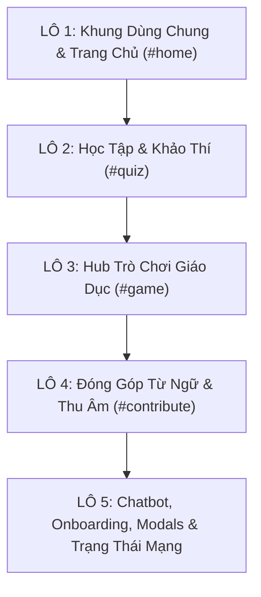

# BÁO CÁO TOÀN DIỆN AUDIT UX & "AI SLOP" — DỰ ÁN XƠ ĐĂNG LINGUA
*Phiên bản ứng dụng: 10.0.3 | Ngày lập: 03/10/2026 | Nhánh: `feat/ui-minimal`*

---

## 1. TỔNG QUAN VÀ ĐỐI TƯỢNG NGHIÊN CỨU
- **Đối tượng người dùng mục tiêu**: Học sinh THCS (11–15 tuổi) tại vùng đồng bào dân tộc thiểu số Tây Nguyên (Kon Tum, Quảng Nam), giáo viên và người tự học ngôn ngữ bản địa.
- **Bối cảnh sử dụng**: Thiết bị di động phổ thông màn hình nhỏ (360px – 414px), máy tính trường học cấu hình yếu, mạng chập chờn hoặc thường xuyên ngoại tuyến hoàn toàn.
- **Mục tiêu tái thiết kế**: Loại bỏ triệt để phong cách "AI slop" (màu mè, sticker 3D, gradient lòe loẹt, chữ hàn lâm sáo rỗng, bố cục căn giữa thừa thãi); chuyển sang phong cách **tối giản, yên tĩnh, chuẩn mực, hỗ trợ tra cứu và học tập tức thì** như một cuốn từ điển học đường hiện đại.

---

## 2. DANH MỤC VẤN ĐỀ AUDIT CHI TIẾT

### 2.1. Nhóm Vấn Đề "AI Slop" & Thẩm Mỹ Rác (Aesthetic Clutter & AI Slop)

| STT | Vị trí / Selector | Hiện tượng & Bằng chứng | Vi phạm nguyên lý | Mức độ | Đề xuất sửa chữa cụ thể |
| :--- | :--- | :--- | :--- | :--- | :--- |
| **SLOP-01** | `#home .home-hero`, `.intro-content` | Tiêu đề căn giữa kèm mô tả dài hàn lâm. Bento stats (4 thẻ thống kê tròn nhiều màu) và thẻ tải Offline Pack to chiếm tới **1327px** chiều cao màn hình, đẩy ô tìm kiếm xuống tận màn hình thứ 2 trên mobile (360px). *(Ảnh: `home_360_light.png`)* | **Nielsen #8** (Minimalist Design), **Nielsen #6** | **P0** | Đưa ô tra từ `#searchForm` lên ngay màn hình đầu tiên (above-the-fold). Xóa bỏ hoặc thu gọn khối Bento Stats xuống thanh chỉ số 1 dòng tối giản dưới chân ô tra từ. |
| **SLOP-02** | Toàn bộ các trang: `.quiz-badge`, `.game-badge`, `.contribute-badge` | Mỗi trang đều có 1 pill nhãn bo tròn viền màu nằm lẻ loi phía trên tiêu đề chính ("Không gian học tập & khảo thí", "Không gian trò chơi học tập", "Cộng đồng & Chia sẻ"). *(Ảnh: `quiz_1280_light.png`, `game_1280_light.png`)* | **Nielsen #8** (AI Slop indicator) | **P1** | Xóa bỏ toàn bộ các pill badge vô nghĩa này. Phân cấp trực tiếp bằng tiêu đề `h1` căn trái rõ ràng, đậm nét, tinh giản. |
| **SLOP-03** | `#game .game-cards-grid .game-card-icon` | 4 thẻ game dùng emoji / sticker màu mè: `🎴` (Lật thẻ), `🧺` (Mưa từ), `🏹` (Bảo vệ làng), `🌾` (Nông trại) nằm trong các vòng tròn màu sắc lòe loẹt (`g1-color` đến `g4-color`). *(Ảnh: `game_1280_light.png`, `game_360_light.png`)* | **Nielsen #8** (AI Slop: Emoji / Clip-art) | **P1** | Thay thế toàn bộ 4 emoji bằng bộ icon nét đơn Lucide SVG chuẩn 24px (`layers`, `shopping-bag`, `shield`, `sprout`), bỏ nền tròn màu sặc sỡ, dùng màu đơn sắc đồng nhất. |
| **SLOP-04** | `#game .game-play-btn` | Cả 4 thẻ game đều lặp lại nút viền vàng cam "Chơi ngay" giống hệt nhau, chiếm diện tích và tạo cảm giác giao diện mẫu tạo tự động. *(Ảnh: `game_1280_light.png`)* | **Nielsen #8** (Button spam) | **P1** | Bỏ nút lặp lại. Biến toàn bộ thẻ game thành card có thể click (interactive card surface) với hiệu ứng viền tinh tế và icon mũi tên chuyển hướng nhẹ nhàng. |
| **SLOP-05** | `#gameOverModal`, `quiz.service.ts` | Sử dụng hàng loạt emoji cảm xúc trong thông báo kết quả: `🎉`, `🏆`, `😢`, `🌟`, `👍`, `💪` kết hợp bóng đổ nặng nề và text nhận xét sáo rỗng. | **Nielsen #8**, **Nielsen #2** | **P1** | Thay bằng biểu tượng nét đơn Lucide (`award`, `check-circle`, `rotate-ccw`) và lời nhận xét thực tế, gần gũi với lứa tuổi học sinh THCS. |
| **SLOP-06** | `tokens.css`, `features/*.css` | Lạm dụng hiệu ứng đổ bóng phát sáng xanh `--shadow-glow: 0 0 15px rgba(30,126,72,0.35)` và gradient nền trang trí `linear-gradient(...)` gây chói mắt và chậm máy yếu. | **Nielsen #8** | **P1** | Chuyển toàn bộ nền về phẳng (`#ffffff` và `#f8fafc` trên Light mode, `#0b1120` và `#1e293b` trên Dark mode). Bỏ shadow glow, chỉ dùng đường viền phẳng 1px phân tách tinh tế. |

---

### 2.2. Nhóm Vấn Đề Khả Năng Tiếp Cận (WCAG 2.2 AA Compliance)

| STT | Vị trí / Selector | Hiện tượng đo lường thực tế | Tiêu chuẩn WCAG | Mức độ | Đề xuất sửa chữa cụ thể |
| :--- | :--- | :--- | :--- | :--- | :--- |
| **A11Y-01** | `#game .game-icon-btn` (4 nút: Bảng vàng, Huy hiệu, Chứng nhận, SFX) | Kích thước đo được: **36 x 36 px**. Khoảng cách hẹp, học sinh dùng điện thoại dễ bấm nhầm. | **WCAG 2.5.5 / 2.5.8** (Target Size: tối thiểu 44 x 44 px) | **P0** | Tăng kích thước hộp bấm tối thiểu lên 44 x 44 px (padding hoặc touch target wrapper), thêm khoảng cách an toàn 8px giữa các nút. |
| **A11Y-02** | `#home .diacritic-btn` (10 nút ký tự Ŏ, Ŭ, Ĕ...) | Chiều cao đo được: **42 px** trên màn hình mobile 360px (< 44px). | **WCAG 2.5.5 / 2.5.8** (Target Size: tối thiểu 44 x 44 px) | **P0** | Tăng `min-height: 44px` cho toàn bộ các nút bàn phím ký tự đặc biệt, đảm bảo diện tích chạm ngón tay chuẩn xác. |
| **A11Y-03** | `tokens.css`: `--text-tertiary: #64748b` trên nền `#f8fafc` | Độ tương phản đo được: **4.0 : 1** (Không đạt chuẩn tối thiểu 4.5:1 cho văn bản thông thường). | **WCAG 1.4.3** (Contrast Minimum: 4.5:1) | **P1** | Đổi `--text-tertiary` thành `#475569` (độ tương phản 5.4:1) trên Light mode, đảm bảo đọc rõ trên màn hình độ sáng thấp. |
| **A11Y-04** | Toàn bộ các thẻ `input::placeholder` | Màu placeholder mặc định `#94a3b8` trên nền trắng có tỷ lệ tương phản **2.9 : 1** (rất mờ, khó đọc). | **WCAG 1.4.3** (Contrast Minimum) | **P1** | Điều chỉnh màu placeholder lên `#64748b` (tương phản 4.6:1), đảm bảo học sinh nhìn rõ gợi ý nhập liệu. |
| **A11Y-05** | Toàn bộ nút và liên kết tương tác | Thiếu chỉ báo focus rõ nét khi duyệt bằng bàn phím (nhiều nút có `outline: none`). | **WCAG 2.4.7** (Focus Visible), **WCAG 2.4.11** | **P1** | Bổ sung quy tắc chung `:focus-visible { outline: 2px solid var(--color-primary); outline-offset: 2px; }` cho mọi phần tử tương tác. |
| **A11Y-06** | `#gameHubView h2` so với các trang khác | Trang chủ, Học tập, Đóng góp dùng thẻ `h1`, riêng trang Trò chơi dùng `h2` làm tiêu đề chính của trang. | **WCAG 1.3.1** (Info and Relationships) | **P2** | Chuẩn hóa toàn bộ tiêu đề trang chính thành `h1`, tiêu đề phân mục thành `h2`, thẻ con thành `h3`. |

---

### 2.3. Nhóm Vấn Đề Bố Cục & Phản Hồi Trạng Thái (Layout, UX & Nielsen Heuristics)

| STT | Vị trí / Selector | Hiện tượng đo lường thực tế | Vi phạm nguyên lý | Mức độ | Đề xuất sửa chữa cụ thể |
| :--- | :--- | :--- | :--- | :--- | :--- |
| **UX-01** | `#chatToggleBtn` (Nút tròn kích hoạt Chatbot) | Đặt tại `bottom: 20px, right: 20px; z-index: 1000`. Trên màn hình di động, nút này nằm đè lên thanh `.mobile-bottom-nav` hoặc che mất nội dung góc phải dưới của trang. *(Ảnh: `home_360_light.png`)* | **Nielsen #1** (Visibility), **Nielsen #7** | **P0** | Trên viewport mobile (< 768px), dời vị trí nút lên trên thanh bottom nav (`bottom: 76px; right: 16px;`) hoặc tích hợp lối vào chat trực tiếp vào thanh điều hướng. |
| **UX-02** | `#chatWindow` (Cửa sổ chat khi mở) | Mở ra dạng hộp chữ nhật lơ lửng 328x440px ở giữa màn hình không có lớp nền tối (backdrop). Khi bàn phím ảo bật lên trên điện thoại sẽ che mất ô nhập tin nhắn. *(Ảnh: `chat_open_360_light.png`)* | **Nielsen #3** (User Control), **Nielsen #2** | **P0** | Trên mobile, chuyển `#chatWindow` thành Bottom Sheet toàn màn hình có nút "Đóng" to rõ, lớp phủ nền mờ và đóng khi nhấn phím `Escape`. |
| **UX-03** | `#loadingOverlay` (Vòng xoay chờ tải toàn màn hình) | Khi tra cứu hoặc tải dữ liệu, hệ thống che toàn bộ màn hình bằng spinner quay tròn (`.spinner`), gián đoạn trải nghiệm người dùng. | **Nielsen #1** (Visibility of System Status) | **P1** | Bỏ spinner toàn màn hình khi tra từ. Thay bằng Skeleton Loading cục bộ ngay trong khung kết quả `#result`. |
| **UX-04** | `#quizTopicSelection` | Khối giới thiệu chiếm 708px màn hình trước khi hiển thị danh sách chủ đề trắc nghiệm. Văn phong: "Không gian học tập & khảo thí", "Phương pháp học tập khoa học giúp bạn ghi nhớ lâu hơn" quá xa lạ với học sinh 11-15 tuổi. *(Ảnh: `quiz_360_light.png`)* | **Nielsen #2** (Match System & Real World), **Nielsen #8** | **P1** | Đổi văn phong mộc mạc ("Học & Ôn từ vựng"), đưa danh sách chủ đề lên đầu trang, bổ sung thẻ tiến độ học từng chủ đề trực quan. |
| **UX-05** | Flashcard trong `#studyInterface` | Chưa có phím tắt cho máy tính trường học (Space để lật thẻ, mũi tên Trái/Phải để chuyển từ); thiếu nút "Quay lại danh mục chủ đề" cố định phía trên. | **Nielsen #3** (Control & Freedom), **Nielsen #7** (Flexibility) | **P1** | Thêm breadcrumb / nút "Quay lại chủ đề" rõ ràng; bắt sự kiện bàn phím phím Cách (Space) để lật thẻ và phím Mũi tên để lướt thẻ. |
| **UX-06** | Giọng văn giới thiệu toàn web | Sử dụng nhiều từ ngữ công nghệ cao: "nền tảng PWA", "Offline Audio Pack (~40MB)", "Khảo thí", "Số hóa bảo tồn ngôn ngữ"... gây ngợp cho lứa tuổi THCS. | **Nielsen #2** (Language of Users) | **P2** | Viết lại vi mô toàn bộ microcopy sang câu từ thân thiện, dễ hiểu: "Tải âm thanh để nghe khi mất mạng", "Luyện từ vựng", "Kiểm tra nhanh". |

---

## 3. ĐỀ XUẤT PHÂN CHIA LÔ THỰC HIỆN (PHASE 3 BATCHES)

Để đảm bảo không gây gián đoạn logic tra từ, quiz, game và bảo toàn tuyệt đối các key `localStorage`, toàn bộ công việc tái thiết kế được chia làm **5 lô độc lập, kiểm chứng lũy tiến**:

### Chi Tiết Từng Lô:

- **LÔ 1 — Khung Dùng Chung & Trang Chủ Tra Cứu (`#home`) [Mức độ ưu tiên: P0]**:
  - *Phạm vi*: `navbar.html`, `footer.html`, `home.html`, `home.ts`, `tokens.css`, `layout.css`, `features/home.css`.
  - *Nhiệm vụ chính*: 
    - Đưa ô tra từ `#searchForm` lên ngay trên đầu trang (above-the-fold), cách đỉnh trang < 120px trên mobile 360px.
    - Xóa bỏ khối Bento stats 4 thẻ màu mè; gộp chỉ số vào 1 dòng thông tin tinh tế dưới ô tìm kiếm.
    - Căn chỉnh thanh phím ký tự đặc biệt Xơ Đăng (chiều cao nút ≥ 44px, cuộn mượt hoặc lưới 2 hàng).
    - Thẻ kết quả tra từ (`.word-card`) dạng từ điển hiện đại, kiểu chữ rõ ràng, nút nghe âm thanh nét đơn Lucide.
    - Thay thế toàn bộ icon Font Awesome trên Navbar, Footer và Trang chủ bằng Lucide SVG nội bộ.

- **LÔ 2 — Học Tập & Thi Trắc Nghiệm (`#quiz`) [Mức độ ưu tiên: P0]**:
  - *Phạm vi*: `quiz.html`, `quiz.ts`, `features/quiz.css`, `quiz.service.ts`.
  - *Nhiệm vụ chính*:
    - Xóa pill badge `.quiz-badge`, thu gọn mô tả lý thuyết hàn lâm.
    - Lưới chọn chủ đề học tập sạch sẽ, hiển thị tiến độ % và số thẻ đã thuộc.
    - Thiết kế lại Flashcard: phẳng, tập trung vào chữ viết Xơ Đăng và nghĩa tiếng Việt, bỏ viền 3D màu mè, thêm phím tắt lật thẻ (Space) và chuyển thẻ (Phím mũi tên).
    - Giao diện trắc nghiệm: 4 đáp án dạng danh sách phẳng, tương phản cao, phản hồi đúng/sai lịch thiệp.

- **LÔ 3 — Hub Trò Chơi Giáo Dục (`#game`) [Mức độ ưu tiên: P1]**:
  - *Phạm vi*: `games.html`, `games.ts`, `features/games.css`, `features/games/leaderboard.ts`.
  - *Nhiệm vụ chính*:
    - Xóa bỏ `.game-badge` và toàn bộ 4 emoji clip-art (`🎴`, `🧺`, `🏹`, `🌾`), thay bằng Lucide SVG (`layers`, `shopping-bag`, `shield`, `sprout`).
    - Nâng kích thước 4 nút hồ sơ học sinh / bảng vàng / huy hiệu từ 36px lên tối thiểu 44 x 44 px (đạt chuẩn WCAG 2.5.5).
    - Bỏ các nút "Chơi ngay" lặp lại trên từng thẻ, biến toàn bộ thẻ thành khối tương tác chuẩn mực.
    - Thiết kế lại thanh HUD điều khiển game (mạng sống, điểm số) và modal hoàn thành màn chơi (bỏ emoji `🎉`, `🏆`, `😢`).

- **LÔ 4 — Đóng Góp Từ Ngữ & Thu Âm (`#contribute`) [Mức độ ưu tiên: P1]**:
  - *Phạm vi*: `contribute.html`, `contribute.ts`, `features/contribute.css`.
  - *Nhiệm vụ chính*:
    - Xóa `.contribute-badge`, căn chỉnh form nhập liệu từ ngữ song ngữ theo lưới thẳng hàng, nhãn form nằm trên ô nhập rõ ràng.
    - Tối giản hóa khung hiển thị sóng âm (visualizer), nút Thu âm / Dừng / Phát lại đạt chuẩn kích thước chạm ≥ 48px.
    - Danh sách hàng đợi đóng góp hiển thị rõ trạng thái offline và nút gửi đồng bộ khi có mạng.

- **LÔ 5 — Trợ Lý AI Chat, Onboarding, Modals & Trạng Thái Mạng [Mức độ ưu tiên: P2]**:
  - *Phạm vi*: `chat.html`, `chat.ts`, `features/chat.css`, `onboarding.html`, `install-modal.html`, `offline-indicator.ts`.
  - *Nhiệm vụ chính*:
    - Định vị lại nút mở Chatbot `#chatToggleBtn` trên mobile tránh đè lên thanh điều hướng底部.
    - Chuyển cửa sổ `#chatWindow` trên mobile thành Bottom Sheet toàn màn hình thân thiện với bàn phím ảo, hỗ trợ đóng bằng phím `Escape`.
    - Viết lại nội dung Onboarding ngắn gọn, trực quan, phù hợp học sinh.
    - Làm gọn modal cài đặt PWA và thanh thông báo mất mạng Offline indicator.

---

## 4. BẢO TOÀN LOGIC & HỢP ĐỒNG MÃ NGUỒN (CODEBASE CONTRACTS)
- Tuyệt đối **không thay đổi** bất kỳ ID phần tử hoặc data attribute nào mà TypeScript đang ràng buộc (`#word`, `#searchForm`, `#result`, `#direction`, `#speechButton`, `#studyQuizTopicsGrid`, `#flashcard`, `#btnExitGame`, `#btnOpenLeaderboard`...).
- Giữ nguyên toàn bộ logic xử lý âm thanh `AudioService`, logic tra cứu nhị phân/tuyến tính `DictionaryService`, các key lưu trữ trong `STORAGE_KEYS` (`hasSeenIntro`, `studyProgressByTopic`, `darkMode`, `xedang_*`).
- Giữ font Font Awesome nguyên vẹn trong suốt quá trình chạy Lô 1 → Lô 5; chỉ thực hiện dọn dẹp ở khâu cuối sau khi xác minh 0 tham chiếu.
