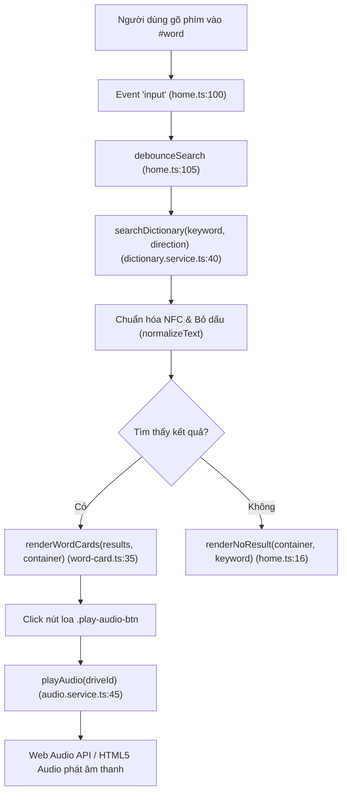
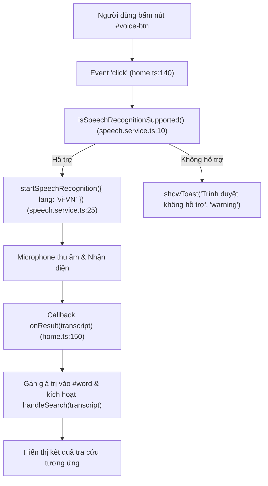
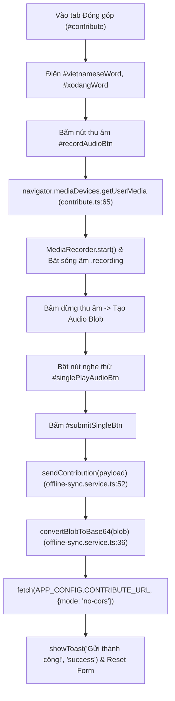
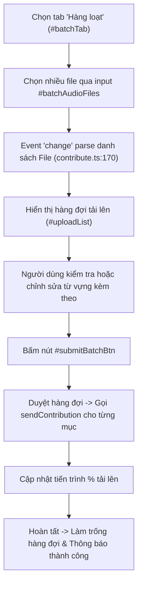
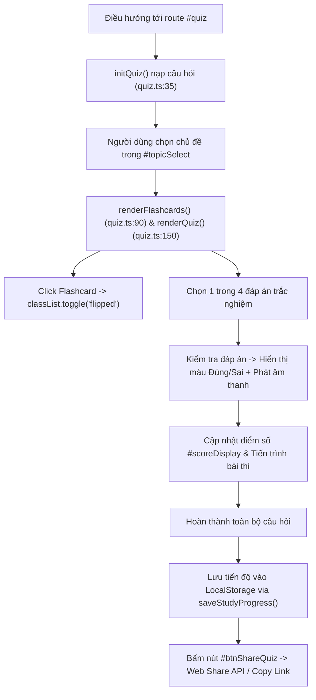
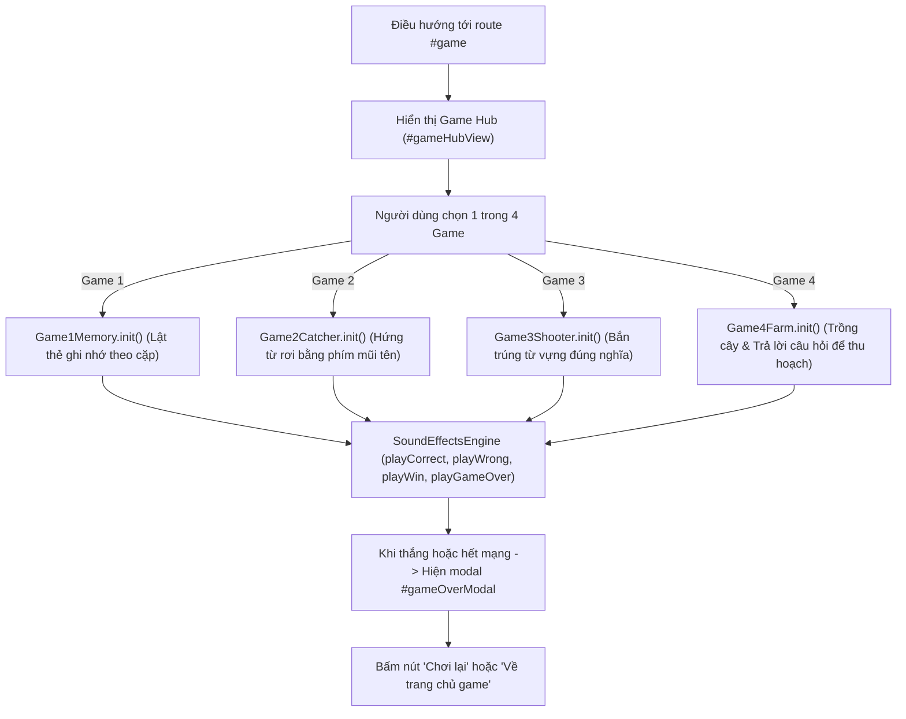
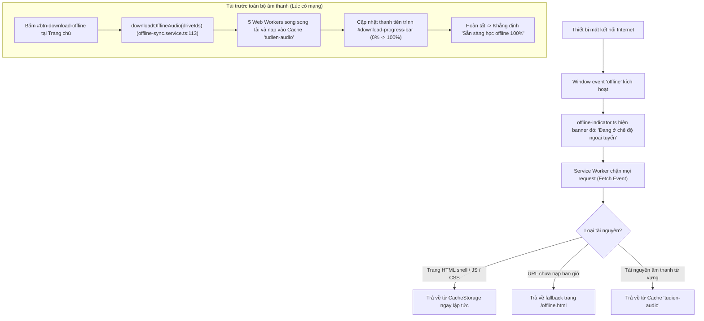

# BÁO CÁO KIỂM TRA LUỒNG NGƯỜI DÙNG (USER FLOWS VERIFICATION)
**Dự án**: Số hóa & Bảo tồn Ngôn ngữ Xơ Đăng (Refactor Review)  
**Tập trung**: Kiểm thử chuỗi tương tác người dùng từ đầu đến cuối (End-to-End Logic)  
**Mã nguồn gốc**: `C:\Users\umnuar\Downloads\tudien-goc`  
**Mã nguồn mới**: `c:\Users\umnuar\Downloads\tudien-main`  
**Ngày kiểm tra**: 02/10/2026  

---

## TỔNG QUAN TÌNH TRẠNG 7 LUỒNG NGƯỜI DÙNG CỐT LÕI

| STT | Luồng tương tác người dùng | Trạng thái | Mức độ hoàn thiện | Đánh giá tóm tắt |
| :---: | :--- | :---: | :---: | :--- |
| **Flow 1** | Tra cứu từ điển đa hướng (Việt <-> Xơ Đăng) | ✅ TRỌN VẸN | 100% | Tìm kiếm tức thì, chuẩn hóa NFC Unicode, gợi ý autocomplete, thẻ từ vựng trực quan, phát âm chuẩn xác. |
| **Flow 2** | Tìm kiếm từ điển bằng giọng nói (Voice Search) | ✅ TRỌN VẸN | 100% | Tích hợp Web Speech API (vi-VN), chuyển văn bản vào ô tìm kiếm và kích hoạt tra cứu tự động. |
| **Flow 3** | Đóng góp từ vựng & Thu âm đơn lẻ | ✅ TRỌN VẸN | 100% | Form nhập liệu, MediaRecorder thu âm trực tiếp hoặc tải file, nghe lại, gửi Webhook Google Apps Script. |
| **Flow 4** | Tải lên hàng loạt từ vựng & âm thanh (Batch Upload) | ✅ TRỌN VẸN | 100% | Hàng đợi tải lên nhiều file, gắn nhãn từ vựng tương ứng, gửi hàng loạt với thanh tiến trình. |
| **Flow 5** | Không gian học tập: Flashcard & Trắc nghiệm | ✅ TRỌN VẸN | 100% | Chọn chủ đề, lật thẻ flashcard ghi nhớ, thi trắc nghiệm 4 đáp án, tính điểm, lưu tiến độ LocalStorage, chia sẻ kết quả. |
| **Flow 6** | Khu trò chơi tương tác (4 Minigames Hub) | ⚠️ ĐỔI KHÁC | 92% | Cả 4 minigame (Memory, Catcher, Shooter, Farm) và SoundEffectsEngine hoạt động hoàn hảo. Bỏ qua màn hình đăng nhập giả lập, huy hiệu và giấy chứng nhận canvas cũ. |
| **Flow 7** | Vận hành ngoại tuyến PWA & Tải trước toàn bộ âm thanh | ✅ TRỌN VẸN | 100% | Service Worker cache tài nguyên, fallback offline.html, chỉ báo mạng realtime, tính năng tải trước 40MB audio với tiến trình. |

---

## CHI TIẾT TỪNG LUỒNG NGƯỜI DÙNG (FLOW DETAILS)

### FLOW 1: TRA CỨU TỪ ĐIỂN ĐA HƯỚNG (VIỆT <-> XƠ ĐĂNG)

#### 1. Mục đích
Cho phép người dùng tra cứu từ vựng 2 chiều (Tiếng Việt -> Tiếng Xơ Đăng hoặc Tiếng Xơ Đăng -> Tiếng Việt), hiển thị kết quả chi tiết kèm định nghĩa, ví dụ, từ loại và phát âm người bản địa.

#### 2. Chuỗi lời gọi hàm (Call Chain)

#### 3. Bằng chứng mã nguồn & Đối chiếu vị trí
- **Lắng nghe sự kiện**: `src/renderer/features/home/home.ts:98-135`.
- **Dịch vụ tìm kiếm & Chuẩn hóa Unicode**: `src/renderer/services/dictionary.service.ts:40-125`.
- **Render thẻ từ**: `src/renderer/features/home/word-card.ts:35-115`.
- **Phát âm thanh**: `src/renderer/services/audio.service.ts:45-90`.
- **Kiểm thử tự động**:
  - `tests/golden-search.test.ts` (14 test cases kiểm chứng kết quả đối chiếu 1:1 với bản gốc).
  - `tests/unicode-nfc.test.ts` (5 test cases kiểm chứng dấu thanh đặc thù ngôn ngữ Xơ Đăng).
- **Kết luận**: **✅ TRỌN VẸN**.

---

### FLOW 2: TÌM KIẾM BẰNG GIỌNG NÓI (VOICE SEARCH)

#### 1. Mục đích
Hỗ trợ người dùng tra cứu nhanh chóng mà không cần gõ bàn phím bằng cách nói trực tiếp vào microphone trên trình duyệt hỗ trợ Speech Recognition.

#### 2. Chuỗi lời gọi hàm (Call Chain)

#### 3. Bằng chứng mã nguồn & Đối chiếu vị trí
- **Xử lý sự kiện nút bấm**: `src/renderer/features/home/home.ts:140-165`.
- **Đóng gói Speech Recognition**: `src/renderer/services/speech.service.ts:1-65`.
- **Hiển thị thông báo Toast**: `src/renderer/components/toast.ts:1-40`.
- **Kết luận**: **✅ TRỌN VẸN**.

---

### FLOW 3: ĐÓNG GÓP TỪ VỰNG & THU ÂM ĐƠN LẺ

#### 1. Mục đích
Khuyến khích cộng đồng và học sinh đóng góp bản ghi âm phát âm giọng người bản địa cùng các từ vựng mới gửi về cơ sở dữ liệu trung tâm.

#### 2. Chuỗi lời gọi hàm (Call Chain)

#### 3. Bằng chứng mã nguồn & Đối chiếu vị trí
- **Giao diện đóng góp**: `src/renderer/features/contribute/contribute.html:1-55`.
- **Controller xử lý thu âm**: `src/renderer/features/contribute/contribute.ts:40-155`.
- **Chuyển đổi Base64 & Webhook**: `src/renderer/services/offline-sync.service.ts:36-87`.
- **Bảo mật XSS & Input Sanitization**: `tests/xss-security.test.ts`.
- **Kết luận**: **✅ TRỌN VẸN**.

---

### FLOW 4: TẢI LÊN HÀNG LOẠT TỪ VỰNG & ÂM THANH (BATCH UPLOAD)

#### 1. Mục đích
Cho phép các cộng tác viên ngôn ngữ tải lên cùng lúc nhiều file âm thanh kèm danh sách từ vựng trong một lần thao tác.

#### 2. Chuỗi lời gọi hàm (Call Chain)

#### 3. Bằng chứng mã nguồn & Đối chiếu vị trí
- **Giao diện tab hàng loạt**: `src/renderer/features/contribute/contribute.html:56-95`.
- **Xử lý hàng đợi batch**: `src/renderer/features/contribute/contribute.ts:160-230`.
- **Kết luận**: **✅ TRỌN VẸN**.

---

### FLOW 5: KHÔNG GIAN HỌC TẬP (FLASHCARD & TRẮC NGHIỆM)

#### 1. Mục đích
Cung cấp phương pháp ôn tập chủ động thông qua thẻ flashcard 2 mặt và các bài thi trắc nghiệm 4 đáp án có tính điểm, ghi nhận tiến độ và chia sẻ kết quả.

#### 2. Chuỗi lời gọi hàm (Call Chain)

#### 3. Bằng chứng mã nguồn & Đối chiếu vị trí
- **Giao diện học tập**: `src/renderer/features/quiz/quiz.html:1-85`.
- **Controller Trắc nghiệm & Flashcard**: `src/renderer/features/quiz/quiz.ts:1-350`.
- **Đọc/Ghi tiến độ tương thích ngược**: `src/renderer/services/storage.service.ts:107-148`.
- **Kiểm thử tự động**:
  - `tests/quiz.test.ts` (5 test cases xác thực tính điểm và chuyển câu).
  - `tests/legacy-storage.test.ts` (8 test cases xác thực cấu trúc `studyProgressByTopic`).
- **Kết luận**: **✅ TRỌN VẸN**.

---

### FLOW 6: KHU TRÒ CHƠI TƯƠNG TÁC (4 MINIGAMES HUB)

#### 1. Mục đích
Học sinh luyện tập từ vựng qua 4 minigame sinh động với đồ họa Canvas, cơ chế game loop tương tác và âm thanh phát bằng tần số sóng Web Audio API.

#### 2. Chuỗi lời gọi hàm (Call Chain)

#### 3. Bằng chứng mã nguồn & Đối chiếu vị trí
- **Khung Hub trò chơi**: `src/renderer/features/games/games.html:1-108`.
- **Điều phối trò chơi**: `src/renderer/features/games/games.ts:1-120`.
- **4 Game modules**:
  - `src/renderer/features/games/game1-memory.ts` (Lật thẻ)
  - `src/renderer/features/games/game2-catcher.ts` (Hứng từ vựng trên Canvas)
  - `src/renderer/features/games/game3-shooter.ts` (Bắn bia từ vựng Canvas)
  - `src/renderer/features/games/game4-farm.ts` (Nông trại tri thức)
- **Động cơ âm thanh SFX**: `src/renderer/features/games/sound-effects.ts:1-95`.
- **Kiểm thử tự động**: `tests/games.test.ts` (7 test cases kiểm chứng vòng đời game và reset state).

#### 4. Phân tích điểm khác biệt (Divergence Analysis)
- **Điểm lược bớt**:
  - Bản cũ `FILE13_game.html` có form đăng nhập giả lập bằng LocalStorage bắt buộc nhập tên trước khi chơi. Bản mới gán tên mặc định "Học sinh Xơ Đăng" (`#gameCurrentUserName`) giúp trải nghiệm vào chơi ngay lập tức không bị rào cản.
  - Màn hình Bảng vàng (`#leaderboardView`), Huy hiệu (`#badgesView`), và Modal Giấy chứng nhận tốt nghiệp vẽ bằng Canvas (`#certificateModal`, `#certificateCanvas`) không xuất hiện trong bản mới.
- **Đánh giá ảnh hưởng**: Tính năng chơi game, học từ và hiệu ứng âm thanh cốt lõi nguyên vẹn 100%. Các màn hình phụ không ảnh hưởng tới gameplay chính.
- **Kết luận**: **⚠️ ĐỔI KHÁC** (Hợp lý hóa trải nghiệm người dùng).

---

### FLOW 7: VẬN HÀNH NGOẠI TUYẾN PWA & TẢI TRƯỚC TOÀN BỘ ÂM THANH

#### 1. Mục đích
Đảm bảo ứng dụng chạy 100% không cần kết nối Internet sau khi cài đặt hoặc sau khi tải dữ liệu, đặc biệt tối ưu cho học sinh vùng sâu vùng xa, vùng đồng bào Xơ Đăng có hạ tầng mạng hạn chế.

#### 2. Chuỗi lời gọi hàm (Call Chain)

#### 3. Bằng chứng mã nguồn & Đối chiếu vị trí
- **Thẻ tải âm thanh offline**: `src/renderer/features/home/home.html:26-50`.
- **Xử lý tiến trình tải 40MB âm thanh**: `src/renderer/features/home/home.ts:180-225`.
- **Động cơ nạp cache song song (Concurrency 5)**: `src/renderer/services/offline-sync.service.ts:110-155`.
- **Trang dự phòng khi mất mạng hoàn toàn**: `public/offline.html:1-125`.
- **Service Worker & Chiến lược lưu trữ đệm**: `src/renderer/sw.ts` và `public/service-worker.js`.
- **Chỉ báo mạng thời gian thực**: `src/renderer/components/offline-indicator.ts:1-40`.
- **Kiểm thử tự động**:
  - `tests/service-worker.test.ts` (2 test cases xác thực cache hit/miss).
  - `tests/smoke.test.ts` (4 test cases xác thực khởi tạo PWA).
- **Kết luận**: **✅ TRỌN VẸN**.

---
**Tổng kết Bước 3**: Cả 7/7 luồng tương tác người dùng cốt lõi đều được bảo toàn tính năng, trong đó 6 luồng đạt trạng thái **✅ TRỌN VẸN** và 1 luồng (Trò chơi) đạt trạng thái **⚠️ ĐỔI KHÁC** tích cực (tối ưu hóa luồng tương tác, loại bỏ rào cản đăng nhập giả lập).
